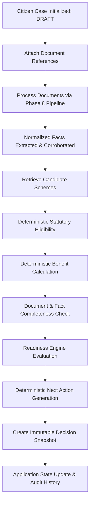

# Phase 10: Application Workflow Architecture

## 1. Overview and Core Philosophy

PolicySetu Phase 10 introduces the **Application Decision Workflow Layer**, establishing an authoritative case lifecycle orchestration framework around the AI decision pipeline created in Phase 8 and exposed via the HTTP microservice in Phase 9.

### Core Architectural Principle
> **The Application Workflow Layer coordinates the lifecycle of citizen cases without duplicating or replacing the underlying statutory engines.**

The workflow orchestrates:
- `RuleEvaluator` (Phase 2 & 3)
- `EligibilityEngine` (Phase 3)
- `ApplicantFact` & `EvidenceRegistry` (Phase 4)
- `Hybrid RAG` (Phase 5)
- `RuleASTMissingFieldAnalyzer` (Phase 6)
- `SnapshotManager` & Policy Versioning (Phase 7)
- `ApplicationPipeline` (Phase 8)
- `BenefitCalculator` (Phase 8 & 9)

## 2. End-to-End Orchestration Flow

## 3. Strict Separation of Three Core Dimensions

A foundational requirement of Phase 10 is avoiding any conflation between the following three distinct dimensions:

| Dimension | Possible States | Purpose | Authority |
|---|---|---|---|
| **Application Lifecycle** | `DRAFT`, `DOCUMENTS_PENDING`, `PROCESSING`, `FACTS_READY`, `SCHEMES_IDENTIFIED`, `ELIGIBILITY_EVALUATED`, `ACTION_REQUIRED`, `READY_TO_APPLY`, `UNDER_REVIEW`, `COMPLETED`, `FAILED`, `CANCELLED` | Tracks technical and procedural case progress | ApplicationStateMachine |
| **Statutory Eligibility** | `PASS`, `FAIL`, `UNKNOWN`, `REVIEW` | Legal government policy determination | RuleEvaluator / EligibilityEngine (Deterministic AST) |
| **Application Readiness** | `NOT_READY`, `ACTION_REQUIRED`, `READY_FOR_REVIEW`, `READY_TO_APPLY`, `COMPLETED` | Pragmatic readiness to submit application to government portal | ApplicationReadinessEvaluator |

### Valid Combinations
- `Statutory Eligibility = PASS`, `Readiness = ACTION_REQUIRED`, `Application Lifecycle = ACTION_REQUIRED` (Applicant meets statutory criteria, but is missing required caste certificate).
- `Statutory Eligibility = REVIEW`, `Readiness = READY_FOR_REVIEW`, `Application Lifecycle = UNDER_REVIEW` (Contradictory evidence between uploaded documents flagged for human caseworker).
- `Statutory Eligibility = FAIL`, `Readiness = NOT_READY`, `Application Lifecycle = ELIGIBILITY_EVALUATED` (Statutory criteria not met; case remains cleanly auditable).
