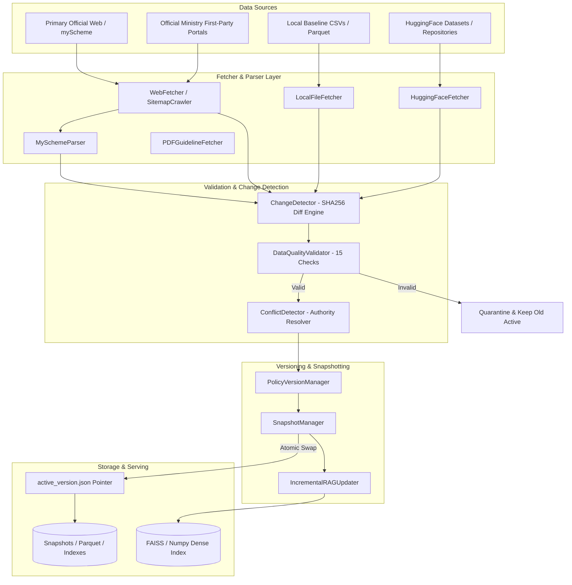

# PolicySetu Phase 7: Dynamic Data Architecture

## 1. Overview and Design Principles

The PolicySetu Phase 7 Dynamic Policy Data Synchronization layer transforms the static, pre-extracted government scheme dataset into a refreshable, version-aware, and reproducible data pipeline.

### Fundamental Principles

1. **Current Static Data = Baseline Snapshot (v0)**:
   The existing local files in `AI/data/raw/` (`schemes.csv`, `schemes_faqs.csv`, `updated_data.csv`, `indian government schemes dataset english and hindi.csv`, and `archive (1).zip`) are treated as the immutable baseline snapshot of the knowledge base. Dynamic pipelines build incremental updates on top of this foundation; baseline files are never deleted or corrupted.

2. **Conservative Activation Invariant**:
   Dynamic fetching and synchronization must adhere to a strict programmatic invariant:
   ```
   Dynamic Fetch
         ↓
   Changed Data
         ↓
   Parse (MySchemeParser / Source Parser)
         ↓
   Validate (15 Statutory Quality Checks)
         ↓
   Diff Against Active Version
         ↓
   Create New Staged Snapshot
         ↓
   [Passes All Thresholds?]
    ├── YES ──> Atomically Switch active_version.json pointer
    └── NO  ──> ABORT & KEEP OLD ACTIVE VERSION
   ```
   A broken, malformed, or 500-error web response never replaces or contaminates the working active dataset.

3. **Dynamic Freshness $\neq$ Statutory Authority**:
   While discovery portals (such as myScheme) provide regular updates and discoverability, they are categorized under `PRIMARY_OFFICIAL` as discovery mirrors. Whenever a scheme-specific first-party ministry or gazette URL is available, it is preserved in `first_party_source_url` and treated as the statutory source of truth.

4. **Clean Incremental Vector Store Updates**:
   When policy updates occur, chunks are partitioned into:
   - `ADD`: compute new dense embeddings and register in chunk index.
   - `UPDATE`: purge stale chunk IDs from active index and cache; compute new dense embeddings.
   - `DELETE / DEACTIVATE`: purge chunk IDs and vectors completely from active retrieval.
   Vector stores (FAISS Flat / Numpy cosine stores) are cleanly reset with active keys only, preventing zombie/stale chunks from appearing in search results.

5. **Content-Hash Source Revisions Over Artificial Semantic Versions**:
   Policy revisions are tracked as immutable content hashes (`policy_<hash[:12]>_<timestamp>`) preserving the underlying `source_revision` and ETag/HTTP Last-Modified metadata, rather than pretending scheme authors follow software semantic versioning (`v1.0.0`).

---

## 2. Component Pipeline Architecture



---

## 3. Directory Layout and File Responsibilities

All Phase 7 code is located under `AI/src/data_pipeline/`:

```
AI/src/data_pipeline/
├── __init__.py               # Public package exports
├── models.py                 # Core data models, Enums, and Audit dataclasses
├── change_detection.py       # Deterministic SHA256 comparison and field-level diffs
├── conflict.py               # Multi-source conflict detection & authority resolution
├── freshness.py              # Freshness status tracking & quarantine rules
├── incremental_rag.py        # Vector store purge, recalculation, and re-indexing
├── snapshot.py               # Atomic snapshot staging, pointer swap, and rollback
├── validation.py             # 15 Statutory data quality validation rules
├── sync.py                   # Main sync pipeline runner (--dry-run, --force-rebuild)
├── validate.py               # Validation CLI runner
├── diff.py                   # Diff inspection CLI runner
├── rebuild.py                # Full corpus rebuild and audit CLI runner
├── sources/
│   ├── __init__.py
│   ├── models.py             # SourceDefinition & AuthorityTier models
│   ├── sources.py            # Registered official, supplementary, and archive sources
│   └── registry.py           # SourceRegistry with domain allowlist & URL validation
├── fetchers/
│   ├── __init__.py
│   ├── base.py               # BaseFetcher abstract interface & HTTP mock handlers
│   ├── web.py                # WebFetcher (conditional GET, rate limiting, retries)
│   ├── myscheme_parser.py    # Dedicated parser for structured myScheme DOM/JSON
│   ├── local.py              # LocalFileFetcher for baseline CSVs and archives
│   ├── huggingface.py        # HuggingFaceFetcher (CSR/NGO vs Gov policy classifier)
│   ├── sitemap.py            # SitemapCrawler for change discovery
│   └── pdf.py                # PDFGuidelineFetcher (OCR_REQUIRED metadata tagging)
└── lineage/
    ├── __init__.py
    ├── models.py             # ProvenanceRecord, TransformationType, FieldAttribution
    └── tracker.py            # LineageTracker audit trail generator
```

---

## 4. Execution Modes and Operational Commands

| Mode | Command | Description |
| :--- | :--- | :--- |
| **Dry Run Sync** | `python -m src.data_pipeline.sync --dry-run` | Fetches, diffs, validates, and stages proposed snapshots without updating `active_version.json`. |
| **Active Sync** | `python -m src.data_pipeline.sync` | Performs full synchronization, validation-gated activation, and incremental FAISS index update. |
| **Quality Audit**| `python -m src.data_pipeline.validate` | Evaluates all 15 quality checks across primary and supplementary records, reporting failures and warnings. |
| **Corpus Diff**  | `python -m src.data_pipeline.diff` | Performs deep field-level comparison between baseline and target corpora, printing criterion changes. |
| **Full Rebuild** | `python -m src.data_pipeline.rebuild` | Verifies integrity across all 4,749 canonical schemes, 51,435 FAQs, 3,400 supplementary records (79 distinct supplementary schemes), and 63,695 chunks. |
