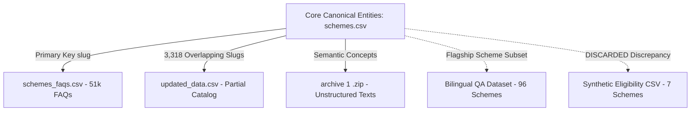

# PolicySetu Cross-Dataset Comparison & Overlap Analysis

This report documents the cross-dataset intersections, schema divergences, record duplicates, field distributions, content conflicts, and coverage metrics across all raw datasets in `AI/data/raw/`.

---

## 🔁 Pairwise Scheme & Record Overlap Matrix

| Baseline Dataset | Compared Dataset | Metric | Overlap Count | Baseline Total | Overlap % |
| :--- | :--- | :--- | :--- | :--- | :--- |
| **`schemes.csv`** | `schemes_faqs.csv` | Scheme Slugs | **4,646** | 4,669 | **99.5%** |
| **`schemes.csv`** | `schemes_faqs.csv` | Scheme Names | **4,646** | 4,669 | **99.5%** |
| **`schemes.csv`** | `updated_data.csv` | Scheme Slugs | **3,318** | 4,669 | **71.1%** |
| **`schemes.csv`** | `updated_data.csv` | Scheme Names | **3,291** | 4,669 | **70.5%** |
| **`schemes.csv`** | `indian govt schemes (EN/HI)`| Scheme Names | **6** (Exact) / **78** (Fuzzy)| 4,669 | **1.7%** |
| **`schemes.csv`** | `Eligibility_Dataset.csv` | Scheme Names | **1** (Exact) / **7** (Fuzzy) | 4,669 | **0.15%** |
| **`schemes.csv`** | `archive (1).zip` | Narrative Titles | **~780** (Fuzzy matched)| 4,669 | **16.7%** |
| **`updated_data.csv`**| `schemes.csv` | Slugs unique to `updated_data` | **79** | 3,397 | **2.3%** |
| **`schemes.csv`** | `updated_data.csv` | Slugs unique to `schemes.csv` | **1,352** | 4,669 | **29.0%** |

---

## 🗂 Common Fields vs Unique Fields Across Datasets

### 1. Fields Common to Multiple Datasets
- **Scheme Title / Name**:
  - `scheme_name` in `schemes.csv`, `schemes_faqs.csv`, `updated_data.csv`, and `indian government schemes dataset english and hindi.csv`.
  - `Eligible_Scheme` in `Indian_Government_Scheme_Eligibility_Dataset.csv`.
- **Slug / Key**:
  - `slug` in `schemes.csv` and `updated_data.csv`.
  - `scheme_slug` in `schemes_faqs.csv`.
- **Eligibility Narrative**:
  - `eligibility` in `schemes.csv` and `updated_data.csv`.
- **Benefits Description**:
  - `benefits` in `schemes.csv` and `updated_data.csv`.
- **Application Procedures**:
  - `application_process` in `schemes.csv` vs `application` in `updated_data.csv`.
- **Documentation Checklist**:
  - `documents_required` in `schemes.csv` vs `documents` in `updated_data.csv`.
- **Administrative Jurisdiction**:
  - `level` in `schemes.csv` and `updated_data.csv` (`Central` / `State`).
  - `state_or_central` in `indian government schemes dataset english and hindi.csv`.
- **Categories & Tags**:
  - `categories` and `tags` in `schemes.csv` vs `schemeCategory` and `tags` in `updated_data.csv`.

### 2. Fields Unique to Specific Datasets
- **Unique to `schemes.csv`** (High Value Metadata):
  - `short_title`: Acronyms used by citizens (e.g. "PMMVY", "PM-KISAN").
  - `state`: Explicit state identifier for all state-level schemes (crucial for geographic filtering).
  - `ministry`: Central nodal ministry.
  - `department`: Implementing state/central administrative department.
  - `beneficiary_type`: Granular target (`Individual`, `Self Help Group`, `Institution`).
  - `target_beneficiaries`: Demographics (`Women`, `Farmers`, `Persons with Disabilities`, `Students`).
  - `benefit_type`: Modality (`Cash`, `In Kind`, `Composite`).
  - `sub_categories`: Sub-sectoral categorization.
  - `detailed_description`: In-depth policy operational guide.
  - `exclusions`: Formal ineligibility and disqualification conditions.
  - `application_mode`: Delivery channel (`Online`, `Offline`, `Online / Offline`).
  - `references`: Supporting government circular URLs and gazette references.
  - `scheme_open_date` & `scheme_close_date`: Operational lifecycle timestamps.
  - `dbt_scheme`: Direct Benefit Transfer tag (`Yes` / `No`).
  - `faq_count`: Number of official questions available.
  - `source_url`: Official myScheme portal web link.
- **Unique to `schemes_faqs.csv`**:
  - `faq_number`: Ordinal ranking of questions per scheme.
  - `question` & `answer`: Dedicated citizen inquiry-answer pairs.
- **Unique to `indian government schemes dataset english and hindi.csv`**:
  - `question`: Authentic Hindi query in Devanagari script.
  - `answer`: Authentic Hindi answer in Devanagari script.
  - `difficulty_level`: Query complexity tag (`Easy`, `Medium`, `Hard`).
  - `launched_year`: Historical launch year (1959-2023).
  - `official_website`: External ministry portal link.
- **Unique to `updated_data.csv`**:
  - `Unnamed: 9`: A completely empty (100% null) parsing artifact.
- **Unique to `Indian_Government_Scheme_Eligibility_Dataset.csv`**:
  - `Age`, `Annual_Income_INR`, `Category`: Demographic inputs artificially paired with 7 scheme labels.
- **Unique to `archive (1).zip`**:
  - Regional folder hierarchy partitioning 1,524 narrative text files across 28 states and central government.

---

## ⚡ Cross-Dataset Conflicts & Discrepancies

### 1. Text Delimiter & Concatenation Conflict (`schemes.csv` vs `updated_data.csv`)
- Across the **3,318 overlapping schemes**:
  - **Eligibility text is identical in only 105 schemes** (3.2%).
  - **Eligibility text differs in 3,213 schemes** (96.8%).
  - **Benefits text is identical in only 329 schemes** (9.9%).
  - **Benefits text differs in 2,989 schemes** (90.1%).
- **Root Cause**:
  - `schemes.csv` preserves bullet boundaries with explicit semicolons and spaces (`; `). For instance:
    > *"The applicant must be a resident of Maharashtra.; Age must be above 18 years.; Annual income must not exceed ₹2,50,000."*
  - `updated_data.csv` was generated from a web-scraper that stripped bullet delimiters and concatenated sentences, frequently omitting spaces after periods or dropping list numbers. For instance:
    > *"The applicant must be a resident of Maharashtra.Age must be above 18 years.Annual income must not exceed ₹2,50,000."*
- **Resolution**: **`schemes.csv` is the authoritative gold standard** and must take absolute precedence over `updated_data.csv`. The latter should only be consulted for its 79 unique schemes.

### 2. Catalog Coverage Asymmetry
- `schemes.csv` contains **1,352 schemes** not present in `updated_data.csv`.
- `updated_data.csv` contains **79 schemes** not present in `schemes.csv`.
- **Reason**: `updated_data.csv` represents an earlier snapshot of the portal, which included schemes that were later retired, migrated, or renamed.
- **Resolution**: Ingest the 79 unique schemes from `updated_data.csv` as supplementary entries with a metadata flag `is_supplementary=True`.

### 3. Statutory Reality vs Synthetic Toy Data Conflict
- `Indian_Government_Scheme_Eligibility_Dataset.csv` directly contradicts statutory eligibility rules:
  | Scheme Name | Statutory Rule (from `schemes.csv` / Government Acts) | Synthetic Dataset Implementation | Status |
  | :--- | :--- | :--- | :--- |
  | **Atal Pension Yojana (APY)** | Entry Age: **18 to 40 years**. Taxpayers strictly excluded. | Marks citizens aged **60 to 80** with income **₹1,100,000** as *Eligible*. | **FATAL CONFLICT** |
  | **PM Kisan Samman Nidhi** | Small & marginal landholding farmer families. Higher income / IT payers excluded. | Indiscriminately assigns non-farmers and individuals earning over ₹1,000,000. | **FATAL CONFLICT** |
  | **PM Awas Yojana (PMAY)** | Target: Houseless or living in kutcha/dilapidated houses; strict income caps (EWS < ₹3L, LIG < ₹6L). | Assigned to random individuals irrespective of housing status or income tier. | **FATAL CONFLICT** |
- **Resolution**: **Completely discard `Indian_Government_Scheme_Eligibility_Dataset.csv`** for any production rule verification or evaluation.

---

## 🗺 Coverage Analysis: Central vs State Jurisdiction

| Dataset | Central Schemes | State Schemes | States & UTs Covered |
| :--- | :--- | :--- | :--- |
| **`schemes.csv`** | 649 schemes | 4,021 schemes | **36 States & Union Territories** (All of India) |
| **`schemes_faqs.csv`** | 646 schemes | 4,000 schemes | **36 States & Union Territories** |
| **`updated_data.csv`** | 512 schemes | 2,888 schemes | Unspecified states (only marked `State`/`Central`) |
| **`archive (1).zip`** | 205 documents | 1,319 documents | **28 States** |
| **`indian govt schemes (EN/HI)`** | 96 schemes | 0 schemes | National Flagship schemes only |
| **`Eligibility_Dataset.csv`** | 7 schemes | 0 schemes | 9 States represented superficially |

---

## 🌐 Language Coverage Comparison

| Dataset | English Content | Hindi Content | Script / Format | Linguistic Role |
| :--- | :--- | :--- | :--- | :--- |
| `schemes.csv` | 100% | 0% | Latin alphabet | Primary catalog & deterministic rules |
| `schemes_faqs.csv` | 100% | 0% | Latin alphabet | Primary FAQ conversational RAG |
| `updated_data.csv` | 100% | 0% | Latin alphabet | Supplementary catalog |
| `indian govt schemes (EN/HI)`| 50% | 50% | **Devanagari script (Hindi)** + Latin | **Multilingual evaluation & query translation benchmark** |
| `archive (1).zip` | 100% | 0% | Latin alphabet (transliterated names) | Unstructured narrative corpus |
| `Eligibility_Dataset.csv` | 100% | 0% | Latin alphabet | Synthetic discard |

---

## 📅 Chronological & Version Differences

- **`schemes.csv`**: Most up-to-date structured catalog. Contains schemes with launch dates recorded up to 2024 and live links pointing to `https://www.myscheme.gov.in/schemes/<slug>`.
- **`schemes_faqs.csv`**: Synchronized with `schemes.csv` (1:1 slug matching).
- **`updated_data.csv`**: Despite its name, this file represents an earlier, uncurated scrape with fewer total schemes (3,400 vs 4,670) and missing modern metadata fields.
- **`archive (1).zip`**: Scraped between 2019 and 2022 from secondary news and aggregation portals (e.g. *sarkariyojana.com*, *business-standard.com*).
- **`indian government schemes dataset english and hindi.csv`**: Historical span from 1959 to 2023, tracking landmark national initiatives.
