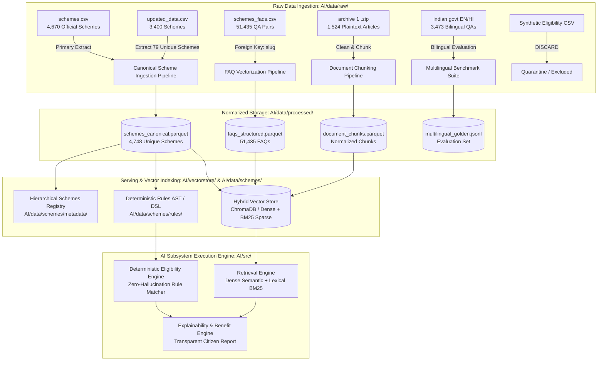

# PolicySetu Recommended Data Architecture & Processing Blueprint

This document outlines the proposed target data architecture, storage tiering, data pipelines, schema unification strategies, and serving interfaces for the **PolicySetu** AI subsystem.

---

## 🏗 Architectural Blueprint



---

## 🗄 Storage Tiering & Pipeline Staging

| Tier | Directory Path | Purpose & Lifecycle |
| :--- | :--- | :--- |
| **Tier 0: Raw Data** | `AI/data/raw/` | Immutable, read-only original files (`schemes.csv`, `schemes_faqs.csv`, `archive (1).zip`, etc.). Strictly never modified. |
| **Tier 1: Interim Data** | `AI/data/interim/` | Machine-readable audit reports, cross-dataset overlap reports, deduplication maps, and parsed tokens. |
| **Tier 2: Processed Data**| `AI/data/processed/` | Deduplicated, schema-standardized tabular files stored in compressed columnar format (e.g. Parquet / JSONL). |
| **Tier 3: Schemes Data** | `AI/data/schemes/` | Scheme-specific structured packages: `metadata/` (JSON descriptors), `rules/` (DSL condition trees), `documents/` (cleaned text). |
| **Tier 4: Test Scenarios**| `AI/data/test_cases/`| Verified ground-truth citizen profiles categorized into `eligible/`, `ineligible/`, and `borderline/`. |
| **Tier 5: Vector Index** | `AI/vectorstore/` | Dense embeddings and BM25 sparse indexes built from canonical schemes, FAQs, and cleaned document chunks. |

---

## 🧩 Unified Scheme Master Schema Design

To achieve 100% coverage without losing data from secondary sources, the canonical dataset should merge `schemes.csv` as the primary base with the 79 unique schemes from `updated_data.csv`.

### Unified Scheme Schema Specification
```typescript
interface CanonicalScheme {
  // Core Identifiers
  id: string;                       // System UUID
  slug: string;                     // Canonical unique slug (e.g., "108easuk")
  scheme_name: string;              // Full official scheme title
  short_title?: string;             // Acronym or popular abbreviation (e.g., "PMMVY")
  level: "Central" | "State";       // Jurisdiction tier
  state?: string;                   // Governing State or UT (null for Central)
  
  // Administrative Hierarchy
  ministry?: string;                // Central Nodal Ministry
  department?: string;              // Implementing State/Central Department
  
  // Beneficiary Target Profile
  beneficiary_type?: string;        // "Individual" | "SHG" | "Enterprise" | "Institution"
  target_beneficiaries: string[];   // ["Farmers", "Women", "SC", "ST", "Students"]
  
  // Categorization & Search
  categories: string[];             // Primary sectors ["Health & Wellness", "Agriculture"]
  sub_categories: string[];          // Granular sector tags
  tags: string[];                   // Search discovery keywords
  
  // Descriptions & RAG Context
  brief_description: string;        // High-level summary (1-2 sentences)
  detailed_description: string;     // In-depth background and scope
  
  // Core Policy Logic & Entitlements
  benefits: {
    raw_text: string;               // Original text
    benefit_type: string;           // "Cash" | "In Kind" | "Composite"
    dbt_scheme: boolean;            // Direct Benefit Transfer enabled
    quantum_summary?: string;       // Estimated monetary or entitlement value
  };
  
  eligibility: {
    raw_text: string;               // Delimited criteria sentences
    parsed_rules?: ConditionNode[]; // Structured condition tree (AST)
    exclusions?: string[];          // Formal negative criteria / disqualifications
  };
  
  // Operational & Procedural
  application: {
    mode: "Online" | "Offline" | "Both";
    process_steps: string[];        // Step-by-step procedural instructions
    documents_required: string[];   // Verification documentation checklist
    official_portal_url?: string;   // Application submission URL
  };
  
  // Metadata & Provenance
  provenance: {
    source_url: string;             // Official myScheme.gov.in link
    references: string[];           // Government circulars / gazettes
    open_date?: string;             // ISO date (YYYY-MM-DD)
    close_date?: string;            // ISO date (YYYY-MM-DD)
    faq_count: number;              // Number of linked official FAQs
    is_supplementary: boolean;      // True if sourced from updated_data.csv 79 unique set
  };
}
```

---

## 🧠 Multi-Tiered AI / RAG Strategy

```
                          ┌───────────────────────────┐
                          │   Citizen Natural Query   │
                          └─────────────┬─────────────┘
                                        │
                                        ▼
             ┌─────────────────────────────────────────────────────┐
             │       Hybrid Retrieval & Semantic Routing           │
             └──────────┬───────────────────────────────┬──────────┘
                        │                               │
                        ▼                               ▼
     ┌───────────────────────────────────┐    ┌───────────────────────────────────┐
     │ Tier 1: Canonical FAQ Store       │    │ Tier 2: Canonical Schemes Catalog │
     │ (51,435 clean Q&A pairs)          │    │ (4,748 rich structured documents) │
     │ Direct citizen question matching  │    │ Broad semantic scheme discovery   │
     └──────────────────┬────────────────┘    └─────────────────┬─────────────────┘
                        │                                       │
                        └───────────────────┬───────────────────┘
                                            │
                                            ▼
                                ┌───────────────────────┐
                                │ Cross-Encoder Rerank  │
                                └───────────┬───────────┘
                                            │ Top-K Schemes
                                            ▼
                        ┌───────────────────────────────────────┐
                        │ Deterministic Eligibility Engine      │
                        │ Hard constraint check (Age, Income,   │
                        │ State, Social Category, Gender)       │
                        │ Zero LLM Hallucination for Criteria   │
                        └───────────────────┬───────────────────┘
                                            │
                                            ▼
                        ┌───────────────────────────────────────┐
                        │ Explainability & Benefit Formulation  │
                        │ Natural language rationale grounded   │
                        │ in verified statutory text            │
                        └───────────────────────────────────────┘
```

1. **High-Precision Conversational RAG (Tier 1)**:
   - Index the 51,435 Q&A pairs from `schemes_faqs.csv`.
   - When a citizen asks a conversational question (*"What documents do I need for Kisan credit card?"*), dense retrieval matches directly against verified official government answers.
2. **Comprehensive Scheme Search (Tier 2)**:
   - Index the 4,748 canonical schemes with metadata filters (`state`, `category`, `beneficiary_type`).
   - Enables faceted discovery and semantic recommendations based on user profiles.
3. **Unstructured Deep Verification (Tier 3)**:
   - Cleaned chunks from `archive (1).zip` provide supplementary long-form context for obscure regional implementation guidelines.
4. **Deterministic Rule Verification (Crucial Zero-Hallucination Layer)**:
   - Instead of asking an LLM *"Is this user eligible?"*, the parsed eligibility condition trees evaluate citizen attributes (Age, Income, State, Gender, Landholding) deterministically.
   - The LLM is used exclusively for natural language synthesis, query understanding, and personalized explanation generation.

---

## 🎯 Benchmark & Evaluation Pipeline Design

### 1. Retrieval Benchmarking
- **Query Corpus**: The 51,435 questions in `schemes_faqs.csv` provide ready-made ground-truth queries paired with corresponding scheme slugs.
- **Evaluation Metrics**:
  - **Hit Rate @ 1, 3, 5**: Does the top-K retrieval list contain the target scheme?
  - **Mean Reciprocal Rank (MRR)**: Measures how high the correct scheme ranks.

### 2. Multilingual Query Benchmark
- **Query Corpus**: The 3,473 paired English-Hindi queries in `indian government schemes dataset english and hindi.csv`.
- **Evaluation Purpose**:
  - Test retrieval accuracy when queries are submitted in Hindi (Devanagari script) against an English scheme index (cross-lingual retrieval).
  - Benchmark translation accuracy and Indic-BERT / multilingual embedding performance.

### 3. Golden Profile Ground-Truth Test Cases
- Instead of using the flawed synthetic dataset, create verified citizen test profiles in `AI/data/test_cases/`:
  - `eligible/`: Profiles intentionally meeting all statutory rules for flagship schemes (PM-Kisan, APY, PMMVY, Sukanya Samriddhi).
  - `ineligible/`: Profiles breaching exact statutory cutoffs (e.g. APY applicant aged 45; PM-Kisan applicant with zero land).
  - `borderline/`: Profiles missing non-mandatory documents or at threshold boundaries.

---

## 📋 Implementation Roadmap (Next Steps)

1. **Phase 1: Canonical Master Dataset Build**
   - Execute deduplication and unification script to merge `schemes.csv` + 79 unique schemes from `updated_data.csv`.
   - Export canonical dataset to `AI/data/processed/schemes_canonical.parquet` and `schemes_canonical.jsonl`.
2. **Phase 2: Text Chunking & Ingestion Preprocessing**
   - Preprocess and tokenize `schemes_faqs.csv` into unified chunk records linking back to canonical scheme IDs.
   - Clean `archive (1).zip` to eliminate scraper noise and segment into regional document chunks.
3. **Phase 3: Deterministic Rule Schema Extraction**
   - Extract condition rules from `eligibility` and `exclusions` fields into structured JSON rule trees (Age limits, Income ceilings, Gender, State criteria).
4. **Phase 4: Vector Index & Retrieval Setup**
   - Generate embeddings using local/offline sentence-transformers and build hybrid retrieval index (Dense + BM25) in `AI/vectorstore/`.
5. **Phase 5: Golden Test Case Suite**
   - Author ground-truth test profiles in `AI/data/test_cases/` for automated verification.
