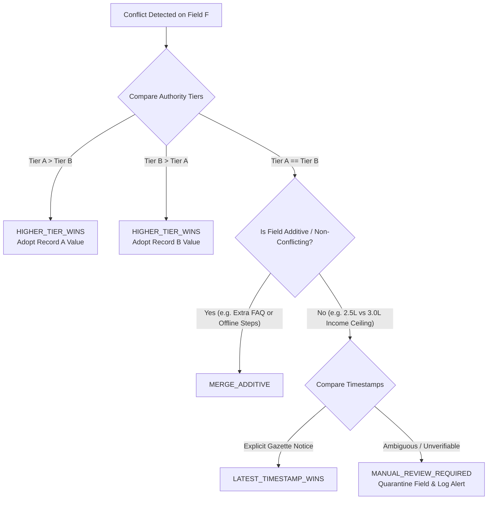

# FIN Conflict Resolution and Multi-Source Reconciliation

## 1. Multi-Source Conflict Detection

When ingesting scheme data from multiple overlapping datasets (e.g. `schemes.csv`, `updated_data.csv`, `indian government schemes dataset english and hindi.csv`, and HuggingFace mirrors), conflicting assertions can emerge regarding:
1. Statutory eligibility limits (e.g., age bracket, income ceiling).
2. Category inclusion/exclusion (e.g., whether OBC or EWS is eligible).
3. Required documentation or application steps.

The `ConflictDetector` evaluates every updated or candidate record against the existing active baseline.

---

## 2. Resolution Strategies and Decision Matrix

When a discrepancy is detected on field $F$ between Record $A$ (Tier $T_A$) and Record $B$ (Tier $T_B$), the engine applies the following decision rules:



### Conflict Resolution Strategy Matrix

| Scenario | Resolution Strategy | Action Taken | Logging & Alerting |
| :--- | :--- | :--- | :--- |
| `PRIMARY_OFFICIAL` vs `SUPPLEMENTARY` | `HIGHER_TIER_WINS` | Official value is adopted unconditionally. Supplementary value discarded for statutory logic. | Recorded in `conflicts_log.json` at `INFO` level. |
| `PRIMARY_CANONICALIZED` vs `SUPPLEMENTARY` (New application steps) | `MERGE_ADDITIVE` | Existing eligibility retained; supplementary steps appended. | Recorded at `INFO` level. |
| `PRIMARY_OFFICIAL` vs `PRIMARY_OFFICIAL` (Different numbers in portal vs gazette) | `MANUAL_REVIEW_REQUIRED` | Conservative statutory fallback applied (most restrictive or gazette primary). Field flagged for human verification. | High-priority alert in validation report and CLI output. |
| Incompatible Types / Corrupted Field | `REJECT_UPDATE` | Corrupted update rejected; previous active value retained. | Critical error; aborts automatic snapshot activation. |

---

## 3. Conflict Audit Record Schema

All resolved and pending conflicts are appended to the snapshot's `conflicts_log.json`:

```json
{
  "conflict_id": "conf_20260921_192153_001",
  "scheme_slug": "national-scholarship-minorities",
  "field_name": "income_ceiling",
  "source_a": {
    "source_id": "primary_schemes_canonical",
    "tier": "PRIMARY_CANONICALIZED",
    "value": 200000
  },
  "source_b": {
    "source_id": "supplementary_schemes_updated",
    "tier": "SUPPLEMENTARY",
    "value": 250000
  },
  "resolution": "HIGHER_TIER_WINS",
  "winning_source_id": "primary_schemes_canonical",
  "adopted_value": 200000,
  "requires_manual_review": false,
  "timestamp": "2026-09-21T19:21:53Z"
}
```

This guarantees complete traceability and eliminates "silent drift" in statutory calculations.
