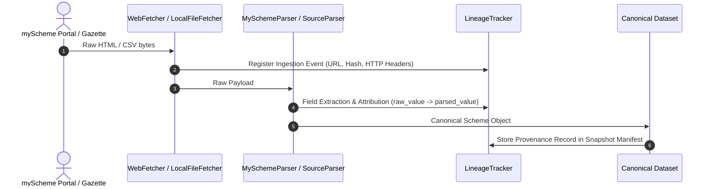

# FIN Data Lineage and Provenance Tracking

## 1. Provenance Architecture and Objectives

In statutory eligibility and citizen advisory systems, every assertion must have undeniable provenance. When an applicant is evaluated for a scheme or an explanation is generated by the LLM layer, the system must trace:
1. Which source file, URL, or gazette notice defined the requirement.
2. What transformations occurred (e.g. currency normalization, Unicode cleaning, parsing).
3. The exact timestamp and version of the parser that produced the canonical representation.

---

## 2. Lineage Data Models and Tracking Schema

Data lineage is captured at both record level and individual field level using `LineageTracker` and standard models in `Intelligence/src/data_pipeline/lineage/models.py`.

### Schema Definitions

```python
class TransformationType(str, Enum):
    INGESTION = "INGESTION"
    CANONICALIZATION = "CANONICALIZATION"
    NORMALIZATION = "NORMALIZATION"
    ENRICHMENT = "ENRICHMENT"
    CONFLICT_OVERRIDE = "CONFLICT_OVERRIDE"
    DEPRECATION = "DEPRECATION"

@dataclass
class FieldAttribution:
    field_name: str
    source_id: str
    raw_value: Any
    transformed_value: Any
    transformation_type: TransformationType
    confidence_score: float = 1.0

@dataclass
class ProvenanceRecord:
    record_id: str
    record_type: str  # "scheme" | "faq" | "rule"
    source_id: str
    source_url: str
    source_revision: str
    ingested_at: str
    parser_version: str
    content_hash: str
    field_attributions: Dict[str, FieldAttribution]
    transformation_history: List[Dict[str, Any]]
```

---

## 3. End-to-End Lineage Flow



---

## 4. Field-Level Attribution in Practice

Consider the extraction of an annual family income ceiling:

```json
{
  "field_name": "annual_family_income",
  "source_id": "official_portal_web",
  "source_url": "https://www.myscheme.gov.in/schemes/pm-kisan",
  "raw_value": "Family income must not exceed Rs. 2.50 Lakh per annum",
  "transformed_value": 250000,
  "transformation_type": "NORMALIZATION",
  "parser_version": "myscheme_v1.0.0",
  "ingested_at": "2026-09-21T19:21:53Z",
  "confidence_score": 1.0
}
```

If a discrepancy arises later between the portal text and a central ministry gazette notification, the `ConflictDetector` uses this exact attribution to identify the origin of the 250,000 threshold and perform statutory override.
