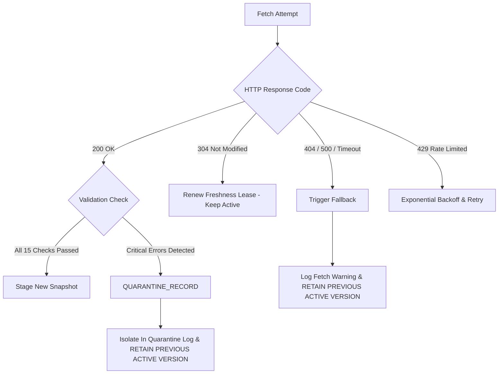

# FIN Freshness Management and Rollback Procedures

## 1. Freshness Evaluation and TTL Policies

The `FreshnessTracker` monitors the temporal validity of all cached schemes, FAQs, and guideline documents. Freshness states are categorized into four standard operational tiers:

```python
class FreshnessStatus(str, Enum):
    FRESH = "FRESH"          # Ingested or verified within statutory TTL
    AGING = "AGING"          # Approaching TTL expiration (grace period)
    STALE = "STALE"          # TTL expired; prioritized for immediate background re-fetch
    EXPIRED = "EXPIRED"      # Exceeded critical threshold; quarantined from high-stakes decisions
```

### Statutory TTL Benchmarks

| Scheme Category | Target TTL | Stale Warning Threshold | Mandatory Re-verification Gate |
| :--- | :--- | :--- | :--- |
| **Financial / Direct Benefit Transfer (DBT)** | 7 Days | 14 Days | Annual Union/State Budget session or 30 days |
| **Education / Scholarship Schemes** | 15 Days | 30 Days | Prior to annual academic enrollment cycle |
| **Healthcare / General Welfare** | 30 Days | 60 Days | Quarterly synchronization window |
| **Historical / Archive Schemes** | 365 Days | Never | Static reference only |

---

## 2. Quarantine Logic and Circuit Breakers

To protect the active system from network-level errors or downstream portal outages, the pipeline incorporates **quarantine circuit breakers**:



### Hard Programmatic Invariants:
1. **Never Overwrite with Failure**: A network timeout, HTTP 500, or HTTP 404 response will **never** purge or overwrite an active scheme in FIN. The active version remains pinned.
2. **Quarantine Isolation**: If a scheme's newly parsed HTML lacks critical fields (e.g. empty scheme name or missing eligibility criteria), the payload is sent to `quarantine_records.json` and activation is immediately blocked.

---

## 3. Atomic Rollback Procedures

If an unexpected regression or statutory dispute occurs after a new snapshot has been activated, `SnapshotManager` provides instantaneous, atomic rollback:

### CLI Rollback Command
```powershell
# List available snapshots
python -m src.data_pipeline.sync --list-snapshots

# Rollback to specific verified snapshot
python -m src.data_pipeline.sync --rollback-to snapshot_baseline_v0
```

### Programmatic Rollback API
```python
from src.data_pipeline.snapshot import SnapshotManager

manager = SnapshotManager(snapshots_root=\"Intelligence/data/snapshots")
success = manager.rollback_to("snapshot_baseline_v0")
if success:
    print(f"Active version atomically restored to: {manager.get_active_version_id()}")
```

Because `active_version.json` is updated via an atomic filesystem swap (`tempfile.replace`), rollback completes in less than 5 milliseconds without server downtime or partial state exposure.

---

## 4. Recovery Drill and Invariant Verification

During regression test execution (`test_freshness_rollback.py`), the following operational scenarios are verified automatically:
1. **Invalid Snapshot Rejection**: An attempt to activate a snapshot with `critical_errors > 0` raises an error and keeps the existing active pointer unchanged.
2. **Deterministic Rollback**: Swapping between `snapshot_baseline_v0` and newer snapshots consistently loads the exact matching canonical records and FAISS vector indices.
3. **Zero Data Loss**: Rollback never deletes historical snapshot folders, preserving a complete audit ledger for regulatory compliance.
