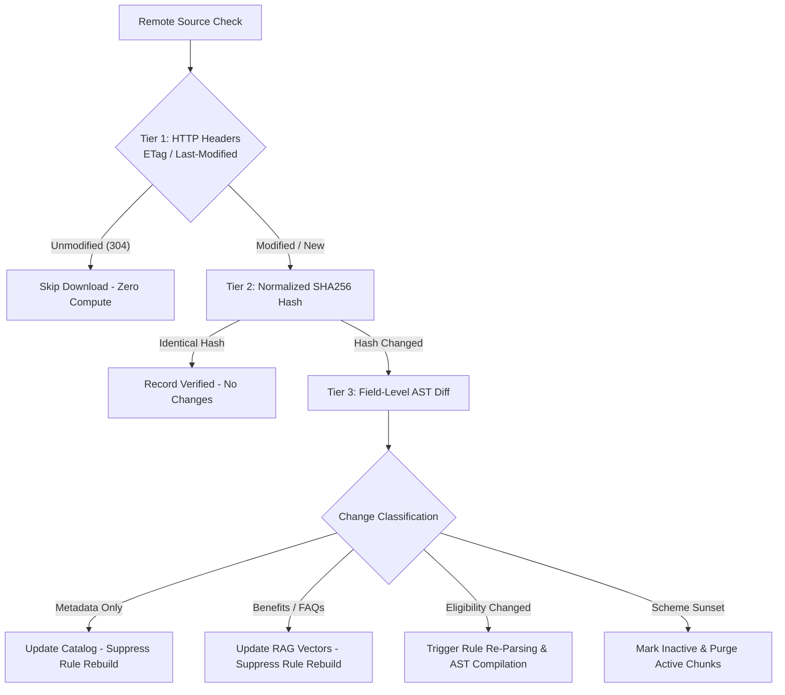

# FIN Synchronization Strategy

## 1. Ingestion Triggers

The FIN synchronization engine supports four distinct ingestion triggers:

1. **Scheduled Sync (Cron)**:
   Runs periodically (e.g., weekly for official portals, monthly for supplementary repositories) to check headers and sitemaps for scheme updates.
2. **Manual CLI Sync**:
   Executed by system administrators:
   ```powershell
   python -m src.data_pipeline.sync [--dry-run] [--force-rebuild]
   ```
3. **Targeted Ingestion (Webhook / Event Trigger)**:
   Invoked when a specific ministry releases a gazette amendment or notifies an API webhook of a policy revision.
4. **On-Demand Query Miss**:
   When citizen retrieval queries indicate an un-indexed scheme or recent budget announcement, the crawler targets the specific scheme slug.

---

## 2. Multi-Stage Change Detection Logic

Change detection is organized into three progressive, compute-efficient evaluation tiers:



### Tier 1: Lightweight Header Verification
Before downloading complete documents or scraping full HTML pages, `WebFetcher` performs an HTTP `HEAD` or conditional `GET` with `If-None-Match` and `If-Modified-Since`. A `304 Not Modified` terminates processing immediately.

### Tier 2: Normalized SHA256 Content Hashing
If content is fetched, `ChangeDetector` strips dynamic timestamps, tracking pixels, session IDs, and zero-width whitespace, and computes a deterministic SHA256 digest of the canonical JSON representation. If the hash matches the active version, no downstream work is performed.

### Tier 3: Field-Level Diff Inspection
When a hash difference is detected, `ChangeDetector.detect_changes()` compares each canonical field individually to isolate exact modifications:

```python
# Example Field-Level Diff Detection
Diff(
    scheme_slug="pm-kisan",
    change_type=ChangeType.POLICY_FIELD_CHANGED,
    field_name="annual_family_income",
    old_value=250000,
    new_value=300000,
    is_eligibility_change=True,
    description="Eligibility field 'annual_family_income' changed from 250000 to 300000"
)
```

---

## 3. Change Classification and Downstream Actions

| Change Class | Affected Fields | Impact on Rules (Phase 3) | Impact on RAG (Phase 5) | Activation Gate |
| :--- | :--- | :--- | :--- | :--- |
| **`METADATA_ONLY`** | `tags`, `categories`, `department_name`, `scheme_type` | None. Rule rebuild is suppressed. | Re-index metadata filters only. | Standard validation checks. |
| **`BENEFITS_ONLY`** | `benefits`, `brief_description`, `faqs` | None. Rule rebuild is suppressed. | Update chunk texts; re-embed modified chunks only. | Text completeness checks. |
| **`ELIGIBILITY_CHANGED`** | `eligibility_criteria`, `age_min`, `age_max`, `income_ceiling`, `caste_categories` | **Full Rule Re-parsing**: Triggers Phase 3 DSL parser, AST validator, and test suite execution. | Re-embed eligibility chunks. | Regression test suite MUST pass. |
| **`DEPRECATION`** | `scheme_status` $\rightarrow$ `INACTIVE` | Remove rules from active engine. | **Purge**: Completely delete vectors from FAISS active retrieval index. | Requires dual-source confirmation or official gazette notice. |

---

## 4. Dedicated MyScheme Parser Pipeline

Raw web fetchers only download raw HTML. To turn unstructured HTML into authoritative canonical records, `MySchemeParser` extracts:

```python
class MySchemeParser:
    def parse_html(self, html_content: str, source_url: str) -> Optional[Dict[str, Any]]:
        # 1. Parse JSON-LD or Next.js __NEXT_DATA__ hydration payload if present
        # 2. Extract DOM sections:
        #    - Scheme Name & Slug
        #    - Eligibility bullet points
        #    - Benefits table / text
        #    - Exclusions list
        #    - Required documents list
        #    - Application steps (Online/Offline)
        #    - FAQs (Q&A pairs)
        #    - Statutory first-party ministry URL
        # 3. Clean zero-width spaces and normalize Unicode text
```

If the parser encounters malformed markup or missing critical sections (e.g., scheme name or eligibility), it emits a structured error, preventing partial records from entering the pipeline.
