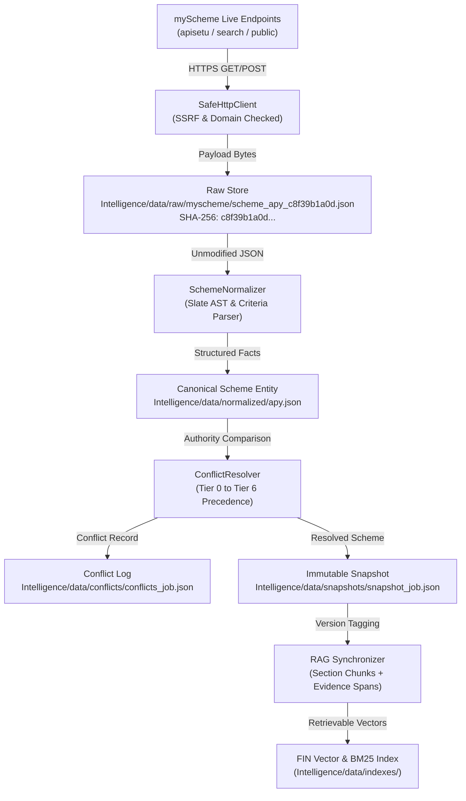

# FIN — Data Lineage & End-to-End Provenance Architecture

## 1. Lineage Principle: No Orphan Facts

In FIN, every policy fact, eligibility criterion, benefit formula, or application requirement presented to a citizen or rule engine must retain **unbroken, auditable cryptographic provenance**.

```
RAW BYTES ON WIRE
       ▼
CONTENT HASH (SHA-256)
       ▼
RAW SOURCE PRESERVATION
       ▼
SECTION & AST EXTRACTION
       ▼
STRUCTURED NORMALIZATION
       ▼
AUTHORITY ARBITRATION & CONFLICT LOGGING
       ▼
IMMUTABLE SNAPSHOT PERSISTENCE
       ▼
PROVENANCE-ATTACHED RAG RETRIEVAL CHUNK
```

---

## 2. End-to-End Lineage Flow



---

## 3. Atomic Provenance Envelope

Every extracted fact carries an immutable evidence metadata block:

```json
{
  "field": "annual_family_income",
  "value": 250000.0,
  "operator": "<=",
  "unit": "INR/year",
  "raw_text": "Annual family income must not exceed Rs. 2,50,000.",
  "evidence_span": "income must not exceed Rs. 2,50,000",
  "source_id": "myscheme",
  "source_url": "https://www.myscheme.gov.in/schemes/apy",
  "source_domain": "www.myscheme.gov.in",
  "authority_tier": "TIER_2_MYSCHEME",
  "effective_from": "2015-06-01",
  "content_hash": "b4bdc119df77685f737fe96ad488f8cde1983213314ae0a385a84687e788270e",
  "extraction_confidence": 1.0,
  "parser_version": "2.0.0",
  "snapshot_id": "crawl_exhaustive_20260924_085446"
}
```

---

## 4. Cryptographic Traceability Guarantee

1. **Unchanged Document Detection**: Using SHA-256 hashes of the raw response payload, the ingestion engine detects when a government portal has republished an identical page, eliminating redundant rule compilation.
2. **Historical Reproducibility**: Because historical snapshots are never overwritten, any past eligibility decision made on a given date (e.g., 2025-03-01) can be precisely audited against the exact policy snapshot active on that date.
3. **Audit Trail**: Machine-readable lineage logs in `Intelligence/data/lineage/` and snapshots in `Intelligence/data/snapshots/` record the exact transformation history of every scheme record from discovery to indexing.
