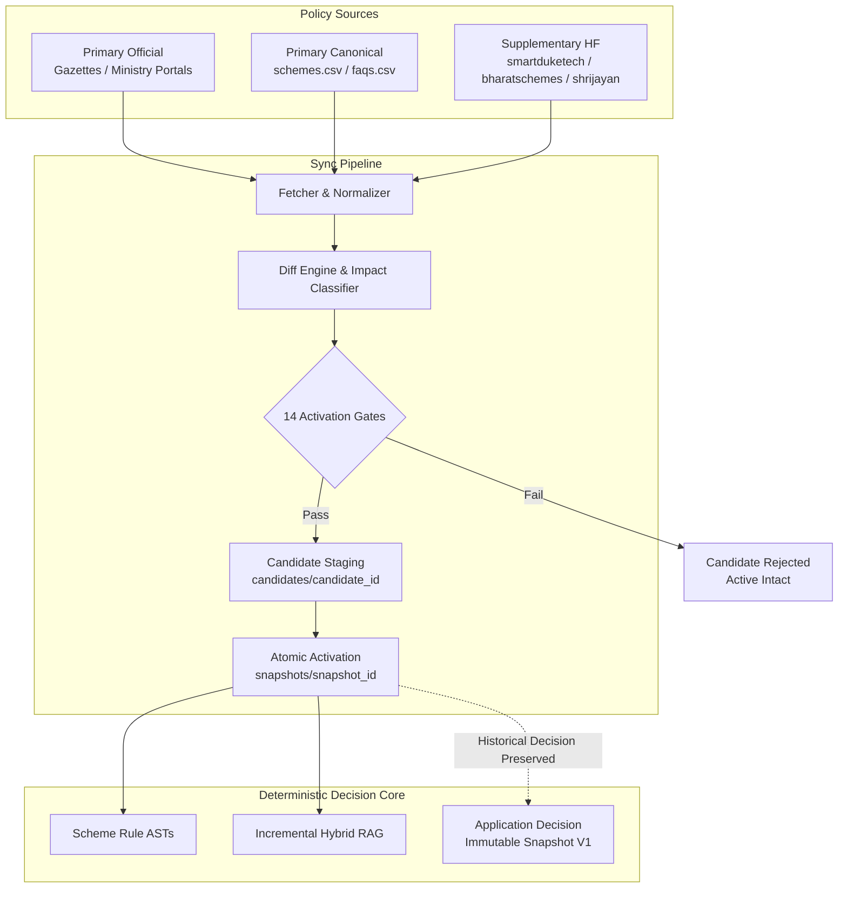

# FIN Phase 12: Dynamic Policy Operations & Live Update Architecture

## 1. Executive Summary

Phase 12 turns the Phase 7 data synchronization foundation into an operational, observable, fail-closed, and safe live policy update engine. It guarantees that live statutory policy changes can be ingested, diffed, classified, validated through 14 deterministic gates, safely staged into candidate snapshots, atomically activated, and instantly rolled back if anomalies arise—while preserving absolute historical decision immutability for past citizen applications.

---

## 2. Core Architectural Principles

1. **AI Interprets, Rules Decide, Evidence Proves, Human Reviews Uncertainty**:
   - Machine learning and NLP assist in query understanding, document extraction, and semantic search.
   - Statutory eligibility decisions (`PASS`, `FAIL`) are strictly evaluated by deterministic rule ASTs.
   - Live updates never allow LLM-generated summaries or supplementary datasets to override statutory rule logic.

2. **Fail-Closed Activation**:
   - Any failure in schema validation, domain allowlisting, duplicate detection, catastrophic deletion limits, or regression tests aborts candidate activation.
   - The currently running active version is never replaced or corrupted by an unsafe or incomplete candidate.

3. **Historical Decision Immutability**:
   - An application evaluated under policy snapshot `V1` freezes that exact policy version, rule set, and fact profile in an immutable `DecisionSnapshot`.
   - When policy snapshot `V2` is promoted, historical decisions remain 100% reproducible against `V1`. Re-evaluations create explicit new snapshot versions (`V2`, `V3`) side-by-side.

4. **Zero Unnecessary Recomputations**:
   - Minor text or FAQ updates update RAG chunk indices incrementally without recompiling statutory rule ASTs.
   - Rule AST recompilation is only triggered when statutory applicant-fact constraints (`income`, `age`, `state`, `social_category`, `disability`) are modified.

---

## 3. Component Inventory

| Component | Module Path | Purpose |
|---|---|---|
| **Source Registry** | `src/data_pipeline/sources/registry.py` | Authority tiers, strict `.gov.in`/`.nic.in` domain allowlists, polling schedules. |
| **HF Supplementary Pipeline** | `src/data_pipeline/sources/huggingface.py` | Ingestion of Hugging Face datasets with commit hashes, revision pinning, role isolation, and CSR filtering. |
| **Change Impact Classifier** | `src/data_pipeline/impact.py` | Classifies 15 fine-grained change types and evaluates deterministic rule impact. |
| **Activation Gate Evaluator** | `src/data_pipeline/gates.py` | 14 fail-closed pre-activation gates verifying schema, authority, URL safety, duplicates, and integrity. |
| **Candidate Snapshot Stager** | `src/data_pipeline/staging.py` | Pre-activation staging under `candidates/`, atomic promotion via temporary symlinks/renames. |
| **Sync Orchestrator** | `src/data_pipeline/orchestrator.py` | Orchestration of dry-runs, live updates, bounded retries, source failure isolation, and atomic rollback. |
| **Incremental RAG Updater** | `src/data_pipeline/incremental_rag.py` | Granular ADD, UPDATE, and DEACTIVATE chunk lifecycle management without full index rebuilds. |
| **Lineage Tracker** | `src/data_pipeline/lineage/tracker.py` | End-to-end cryptographic and versioned provenance from source payload to vector chunk. |
| **Policy API Layer** | `src/api/routes/policy.py` | Authenticated management endpoints for status, sources, dry-run, live sync, and rollback. |
