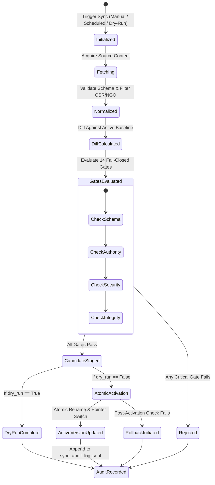

# FIN Phase 12: Sync Lifecycle & Candidate Staging

## 1. Synchronization Lifecycle Overview

FIN enforces a strict, multi-stage synchronization pipeline ensuring that live data ingestion never pollutes or destabilizes the active statutory policy environment.

---

## 2. Detailed Lifecycle Stages

### Stage 1: Trigger & Parameterization
A sync job is instantiated with a unique `sync_id` (format: `sync_YYYYMMDD_HHMMSS`), an optional target `source_id`, and a `dry_run` flag. A new `SyncJob` tracking record is created with status `PENDING` or `DRY_RUN`.

### Stage 2: Ingestion with Failure Isolation & Exponential Backoff
- Each enabled source is fetched individually.
- Network and API operations use bounded retries (default: 3 attempts) with exponential backoff (`factor=0.5s`).
- **Source Failure Isolation**: If a single source fails (e.g. timeout, HTTP 500, or invalid payload), that specific source failure is recorded as an error, but does not abort sync for other healthy sources.

### Stage 3: Normalization & Role Routing
- Raw JSON/CSV/Parquet records are converted into canonical scheme dictionaries.
- Data from Hugging Face is routed according to its role:
  - `smartduketech`: Scheme metadata enrichment.
  - `bharatschemes`: Natural language benchmark queries (answers are barred from statutory rules).
  - `shrijayan`: Text corpus for supplementary semantic retrieval.

### Stage 4: Semantic Diff & Impact Classification
- The `PolicyChangeClassifier` compares candidate records against the currently active policy baseline.
- Differences are tagged across 15 semantic impact types (`SCHEME_ADDED`, `ELIGIBILITY_CHANGED`, `BENEFIT_CHANGED`, etc.).
- The `RuleImpactAnalyzer` inspects changed field names to determine if `RULE_RECOMPILE_REQUIRED` is `True`.

### Stage 5: Evaluation of 14 Activation Gates
Candidate data must pass all 14 deterministic gates:
1. Schema conformity
2. Source authority ordering
3. Strict government URL domain allowlist
4. Unique scheme ID validation
5. Unique slug validation
6. Non-empty statutory eligibility criteria
7. Full provenance tracking
8. Rule extraction validation
9. Rule compilation validation
10. Incremental RAG index compatibility
11. Source conflict resolution
12. Corpus integrity (catastrophic deletion safeguard: max 10% removal)
13. Deterministic regression verification
14. Snapshot self-consistency

### Stage 6: Candidate Staging
If gates pass, artifacts are staged in `Intelligence/data/snapshots/candidates/candidate_<sync_id>/`:
- `canonical/schemes.jsonl`
- `source_manifest.json`
- `changes.json`
- `conflicts.json`
- `metadata.json`
- `gate_report.json`

At this stage, `active_version.json` has NOT been touched.

### Stage 7: Atomic Promotion or Rejection
- **Dry-Run**: Job finishes with status `DRY_RUN`, leaving active files intact.
- **Rejected**: Job is marked `REJECTED`, active files remain untouched, and rejection reasons are logged.
- **Live Promotion**: The staging directory is atomically promoted into `Intelligence/data/snapshots/snapshot_YYYYMMDD_HHMMSS_ffffff/`. The pointer file `active_version.json` is atomically updated via temporary file replacement.

### Stage 8: Audit Logging
The completed `SyncJob` is written to `Intelligence/data/snapshots/sync_audit_log.jsonl`. PII, API tokens, and applicant credentials are strictly scrubbed prior to persistence.
