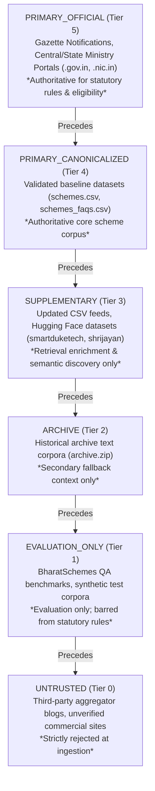

# FIN Phase 12: Source Authority & Precedence Model

## 1. Authority Hierarchy

FIN enforces strict statutory source authority ordering. Source authority governs which data source wins when factual conflicts arise, and strictly delineates which datasets are allowed to influence statutory eligibility decisions.

---

## 2. Invariant Rules of Authority

### Invariant 1: Supplementary Sources Cannot Alter Statutory Rules
- `SUPPLEMENTARY` sources (such as Hugging Face datasets, news feeds, or NGO repositories) can enrich semantic search, user discovery, and document explanation.
- **Under no circumstances** can a `SUPPLEMENTARY` or `ARCHIVE` source override a statutory eligibility constraint (`annual_family_income`, `age_min`, `age_max`, `social_category`, `state`, etc.) defined by a `PRIMARY_OFFICIAL` or `PRIMARY_CANONICALIZED` source.
- `SUPPLEMENTARY` sources are strictly barred from directly generating a statutory `PASS` or `FAIL` outcome.

### Invariant 2: Retention and Audit of Conflicts
If a supplementary source asserts a different factual requirement than an authoritative primary source (e.g., Primary states `income <= ₹2,50,000`, while Supplementary claims `income <= ₹3,00,000`):
1. **Both values are preserved** in `conflicts.json`.
2. The conflict is recorded in the snapshot audit trail.
3. The affected knowledge node is flagged with `conflict_status = "CONFLICT_DETECTED"`.
4. The statutory rule evaluator **exclusively uses the Primary Official source**.
5. RAG retrieval responses present the primary figure as authoritative, but may present the supplementary discrepancy with clear source attribution.

### Invariant 3: Equal-Authority Primary Conflicts
When two sources with identical authority tiers disagree (e.g. `PRIMARY_OFFICIAL` Gazette vs `PRIMARY_OFFICIAL` Department circular):
1. The system **never** silently chooses one over the other.
2. The scheme is flagged with `POLICY_SOURCE_CONFLICT`.
3. Automatic statutory mutation is blocked.
4. A human review event (`MANUAL_REVIEW`) is generated.
5. In citizen evaluations, ambiguous criteria evaluate to `UNKNOWN` or `REVIEW`, never an ungrounded `PASS` or `FAIL`.

---

## 3. Authority Tier Definitions

| Tier Enum | Priority | Permitted Fetch Domains | Permitted for Statutory Rules? | Permitted for RAG? | Permitted for Evaluation? |
|---|---|---|---|---|---|
| `PRIMARY_OFFICIAL` | 5 | Exact `.gov.in`, `.nic.in` | **YES** (Authoritative) | **YES** | **YES** |
| `PRIMARY_CANONICALIZED` | 4 | Local verified baseline | **YES** (Authoritative) | **YES** | **YES** |
| `SUPPLEMENTARY` | 3 | Approved Hugging Face, verified partners | **NO** (Strictly Barred) | **YES** (Enrichment) | **YES** |
| `ARCHIVE` | 2 | Verified local archives | **NO** (Strictly Barred) | **YES** (Fallback) | **YES** |
| `EVALUATION_ONLY` | 1 | Approved benchmark repos | **NO** (Strictly Barred) | **NO** (Evaluation Only) | **YES** |
| `UNTRUSTED` | 0 | Unverified / External | **NO** (Rejected) | **NO** (Rejected) | **NO** |
