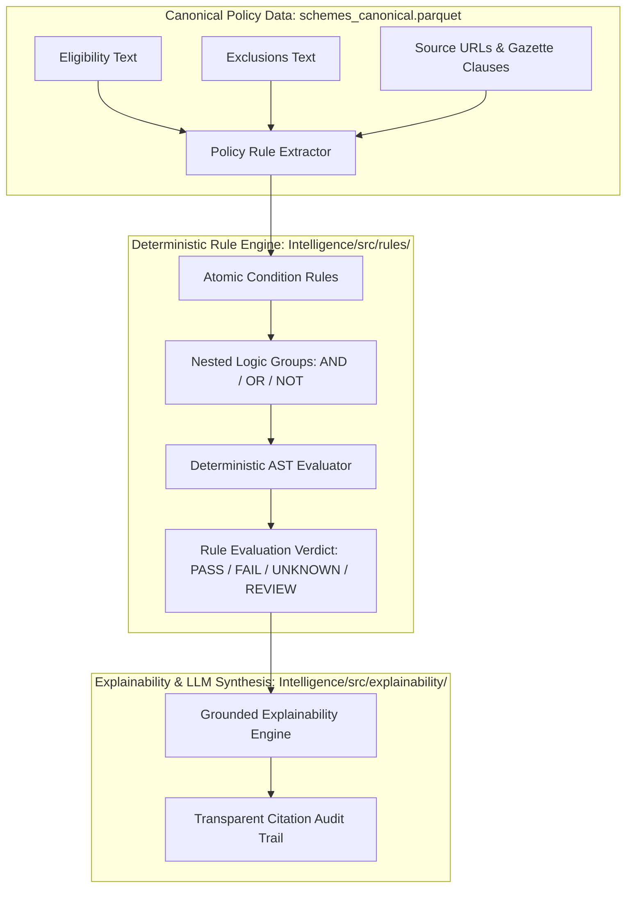
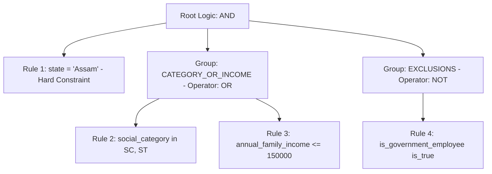

# FIN Policy Rule Model & AST Architecture

This document defines the formal domain model, Abstract Syntax Tree (AST) structure, condition hierarchy, and evaluation semantics for the **FIN Deterministic Eligibility Rule Engine**.

---

## 🏛 1. Architectural Philosophy

Government welfare policies in India combine rigorous statutory thresholds (e.g. entry age bounds, income limits, state residency, caste certificates) with descriptive, qualitative guidelines (e.g. *"applicant must be in genuine economic distress"*).

To eliminate hallucinations while preserving total transparency, FIN enforces a **Dual-Plane Rule Architecture**:



1. **Deterministic Plane**: Hard numerical, boolean, and set-membership constraints are evaluated mathematically by the rule engine. **LLMs are strictly forbidden from deciding final eligibility**.
2. **Grounded Reasoning Plane**: When rules evaluate to `PASS`, `FAIL`, `UNKNOWN`, or `REVIEW`, the engine generates natural language rationale strictly anchored to the original clause citation.

---

## 🌳 2. Abstract Syntax Tree (AST) Hierarchy

A scheme's rule specification is structured as a hierarchical condition tree:

```
SchemeRuleDefinition
 ├── scheme_id (UUID)
 ├── scheme_slug (string)
 ├── root_logic ("AND" | "OR")
 ├── logic_groups (Array of composite logic blocks)
 └── rules (Array of atomic Rule nodes)
      ├── rule_id
      ├── rule_type ("eligibility" | "exclusion" | "conditional" | "document_requirement" | "benefit_condition")
      ├── field
      ├── operator
      ├── expected_value
      ├── value_type
      ├── hard_constraint (boolean)
      ├── condition: { field, op, val, unit }
      └── provenance: { source_dataset, extractor, review_status, ... }
```

### Atomic Condition Node
The core computable unit is the atomic `condition` object:
```json
{
  "field": "annual_family_income",
  "op": "<=",
  "val": 250000,
  "unit": "INR"
}
```

---

## ⚙ 3. Supported Operators & Semantics

| Category | Operator | Valid Value Types | Semantic Evaluation |
| :--- | :--- | :--- | :--- |
| **Numeric Comparisons** | `>=` | `numeric` | `applicant[field] >= val` |
| | `>` | `numeric` | `applicant[field] > val` |
| | `<=` | `numeric` | `applicant[field] <= val` |
| | `<` | `numeric` | `applicant[field] < val` |
| | `=` | `numeric`, `string`, `boolean` | `applicant[field] == val` |
| | `!=` | `numeric`, `string`, `boolean` | `applicant[field] != val` |
| | `between` | `range` (`{min, max}`) | `val.min <= applicant[field] <= val.max` |
| **Set & Category Matching** | `in` | `list_string` | `applicant[field] in val` |
| | `not_in` | `list_string` | `applicant[field] not in val` |
| | `contains` | `list_string`, `string` | `val in applicant[field]` |
| | `contains_any` | `list_string` | `bool(set(applicant[field]) & set(val))` |
| | `contains_all` | `list_string` | `set(val).issubset(set(applicant[field]))` |
| **Boolean State** | `is_true` | `boolean` | `applicant[field] is True` |
| | `is_false` | `boolean` | `applicant[field] is False` |
| **Unstructured / Review** | `unstructured_nlp` | `unstructured` | Qualitative condition evaluated via verified NLP assertion |
| | `manual_review` | `unstructured` | Requires designated human casework officer review |

---

## 🔀 4. Composite Logic & Group Nesting

Complex welfare policies frequently contain compound boolean logic such as:
> *"The applicant must be a resident of Assam AND (must belong to SC/ST category OR have an annual family income <= ₹1,50,000) AND must NOT be a government employee."*

This is modeled in the FIN schema using nested `logic_groups`:



### Logic Evaluation Rules
1. **`root_logic: "AND"`**:
   - Every mandatory hard constraint and logic group must evaluate to `PASS`.
   - If any hard constraint evaluates to `FAIL`, the overall scheme verdict is `FAIL` (immediate disqualification).
2. **`logic_group: "OR"`**:
   - Evaluates to `PASS` if at least one rule in the group evaluates to `PASS`.
   - Evaluates to `UNKNOWN` if no rule passes, but at least one rule is `UNKNOWN`.
   - Evaluates to `FAIL` only if all rules in the group evaluate to `FAIL`.
3. **`logic_group: "NOT"` (Exclusions)**:
   - Evaluates to `FAIL` (scheme disqualification) if the applicant satisfies any exclusion condition (e.g. `is_taxpayer == true`).

---

## 🛡 5. Rule Types & Functional Roles

1. **`eligibility` (Positive Rules)**:
   - Core qualification criteria that the citizen must satisfy (Age, Residency, Social Category, Gender, Occupation).
2. **`exclusion` (Negative Rules)**:
   - Disqualification criteria that immediately disqualify an otherwise qualified applicant (e.g. Institutional landholders, Income tax payers, Beneficiaries of conflicting schemes).
3. **`conditional` (Branching Rules)**:
   - Secondary rules that activate only if a primary rule passes (e.g. *"If student is studying in 11th standard, must have secured minimum 60% marks in 10th standard"*).
4. **`document_requirement` (Verification Mandates)**:
   - Specifies verification documents that must be uploaded (e.g. Caste Certificate, Land Ownership Records, Income Certificate).
5. **`benefit_condition` (Tiering Rules)**:
   - Rules determining the quantum of benefit received (e.g. *"₹5,000 for single girl child; ₹10,000 if family has two girl children"*).

---

## 📌 6. Provenance & Auditability Specification

To guarantee legal auditability, every atomic rule retains an immutable provenance block:

```json
{
  "source_dataset": "schemes_canonical.parquet",
  "extractor": "policy_rule_extractor_v1",
  "extraction_timestamp": "2026-09-21T16:30:00Z",
  "review_status": "VERIFIED_DETERMINISTIC"
}
```

- **`VERIFIED_DETERMINISTIC`**: High-confidence rule directly convertible into a computable mathematical operator.
- **`HEURISTIC_PARSED`**: Rule parsed via validated pattern matching, requiring operational spot-checking.
- **`UNSTRUCTURED_REQUIRES_LLM_OR_MANUAL_REVIEW`**: Complex narrative requirement preserved verbatim without guessing.
